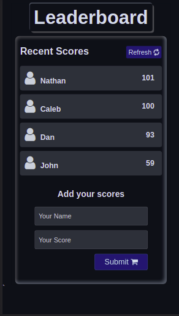
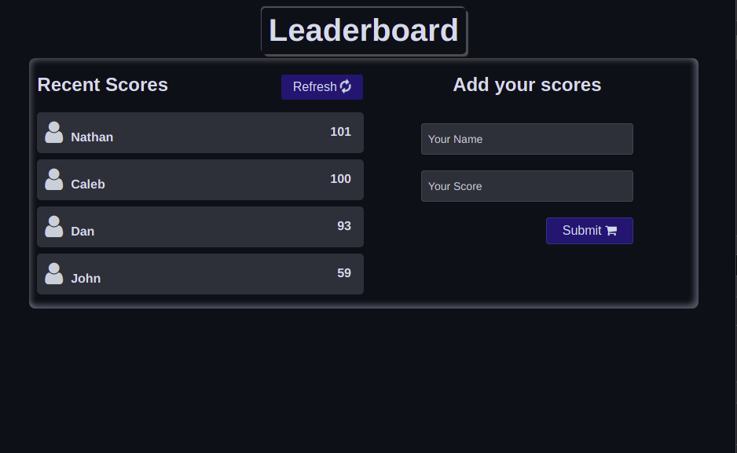

# Leaderboard_App

## Description

Mobile version | Desktop Version
---------------------|----------------------
 | 


>  The leaderboard website displays scores submitted by different players. It also allows you to submit your score. All data is preserved thanks to the external [Leaderboard API service](https://www.notion.so/Leaderboard-API-service-24c0c3c116974ac49488d4eb0267ade3).

## Built With

- HTML
- SCSS
- JavaScript

## Get Started

To get a local copy up and running follow these simple example steps.

1. Clone the Repo or Download the Zip file or ``` https://github.com/tresorsawasawa/Leaderboard_App.git ```.
2. ``` cd /Leaderboard_App ```
3. Open it with the live server

## Test

For tracking linter errors locally you need to follow these steps:

After cloning the project you need to run these commands

``` npm install ```  `` This command will download all the dependancies of the project ``

For tracking linter errors in HTML files run:

``` npx hint . ```

For tracking linter errors in CSS or SASS files run:

``` npx stylelint "**/*.{css,scss}" ```

And For tracking linter errors in JavaScript files run:

``` npx eslint . ```
## Live Demo

See the live by clicking [Live Demo Link](https://tresorsawasawa.github.io/Leaderboard_App/dist)

## Authors

👤 **Author**

- GitHub: [@tresorsawasawa](https://github.com/tresorsawasawa)
- Twitter: [@tresorsawasawa](https://twitter.com/TresorSawasawa)
- LinkedIn: [Trésor Sawasawa](https://www.linkedin.com/in/tr%C3%A9sor-sawasawa-43745320b/)

## 🤝 Contributing

Contributions, issues, and feature requests are welcome!

Feel free to check the [issues page](../../issues/).

## Show your support

Give a ⭐️ if you like this project!

## Acknowledgments

- Thanks to everyone who will get time to check this code and sugest any [issue](https://github.com/tresorsawasawa/MyPortfolio/issues) to improve the page.
- Thank you [Microverse](https://www.microverse.org/)

## 📝 License

This project is [MIT](./MIT.md) licensed.
